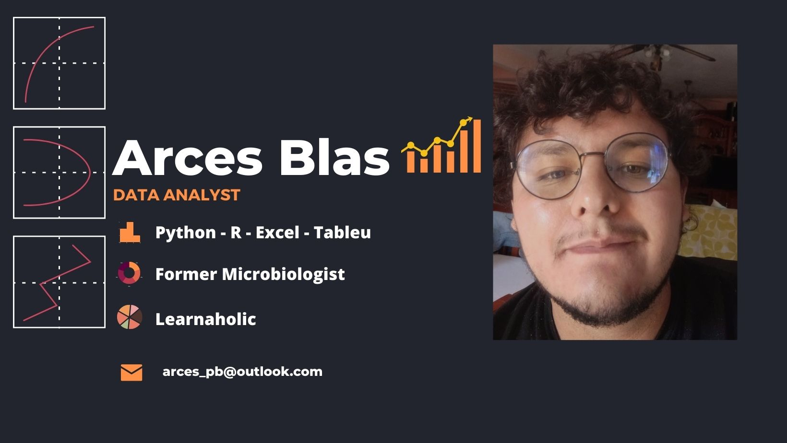

<!--
**arcesblas/arcesblas** is a ✨ _special_ ✨ repository because its `README.md` (this file) appears on your GitHub profile.

Here are some ideas to get you started:

- 🔭 I’m currently working on ...
- 💬 Ask me about ...
- 😄 Pronouns: ...
- ⚡ Fun fact: ...
-->
Hi there 👋, my name is! :smiley:

Looking to pivot to a career in data.
I am currently working very hard learning:
- How to be a Python ninja 🥷
- How to be a samurai in R ⚔️
- How to be a database wizard 🧙‍♂️
- How to be a master of Excel and data visualization 👨‍🏫
- And of course! Statistics and calculus 📈

I speak Spanish and English (I am learning German but I am not fluent yet :disappointed_relieved:).

📫 How to reach me:  
🔗 [Linkedin](https://www.linkedin.com/in/arcesblas/)  
🔗 [Twitter](https://twitter.com/arcesblas)  
🔗 [Deepnote](https://deepnote.com/@arcesblas)   

## Spotify Playing 🎧

